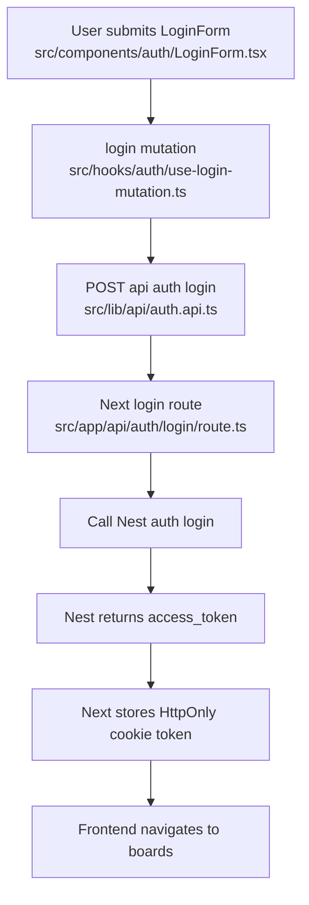

# 1. Auth Cookie Flow

```mermaid
flowchart TD
    A[User submits LoginForm<br/>src/components/auth/LoginForm.tsx] --> B[login mutation<br/>src/hooks/auth/use-login-mutation.ts]
    B --> C[POST api auth login<br/>src/lib/api/auth.api.ts]
    C --> D[Next login route<br/>src/app/api/auth/login/route.ts]
    D --> E[Call Nest auth login]
    E --> F[Nest returns access_token]
    F --> G[Next stores HttpOnly cookie token]
    G --> H[Frontend navigates to boards]
```

## Notes

- Cookie is `HttpOnly`, so frontend JavaScript cannot read it directly.
- Browser sends cookie automatically on same-site requests.

