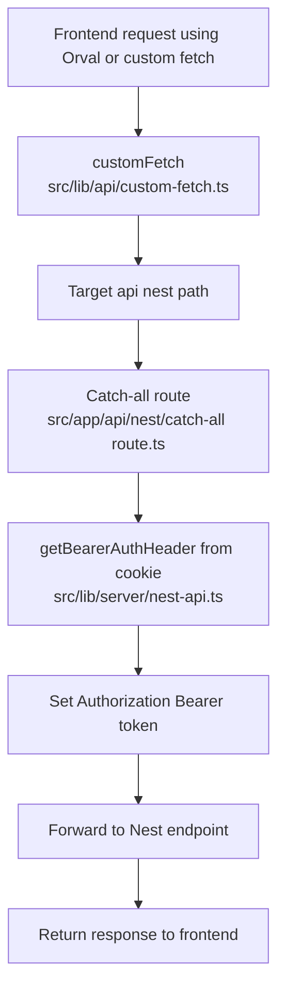

# 2. Next Proxy To Nest

```mermaid
flowchart TD
    A[Frontend request using Orval or custom fetch] --> B[customFetch<br/>src/lib/api/custom-fetch.ts]
    B --> C[Target api nest path]
    C --> D[Catch-all route<br/>src/app/api/nest/catch-all route.ts]
    D --> E[getBearerAuthHeader from cookie<br/>src/lib/server/nest-api.ts]
    E --> F[Set Authorization Bearer token]
    F --> G[Forward to Nest endpoint]
    G --> H[Return response to frontend]
```

## Notes

- Frontend never calls Nest protected endpoints directly.
- Next route centralizes token-to-header conversion.

