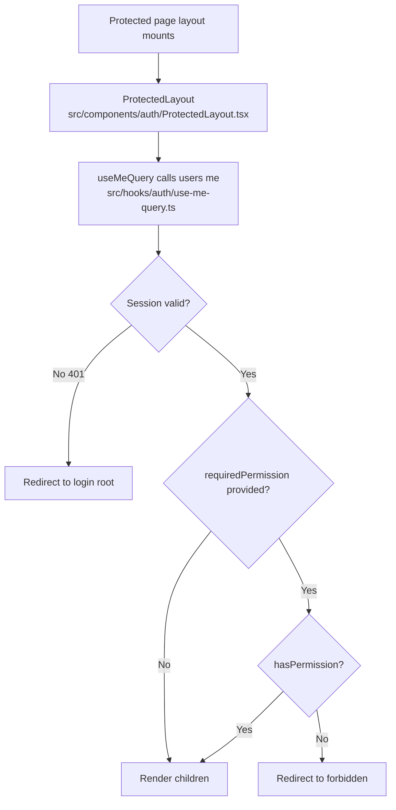

# 3. Protected Layout Guard

```mermaid
flowchart TD
    A[Protected page layout mounts] --> B[ProtectedLayout<br/>src/components/auth/ProtectedLayout.tsx]
    B --> C[useMeQuery calls users me<br/>src/hooks/auth/use-me-query.ts]
    C --> D{Session valid?}
    D -- No 401 --> E[Redirect to login root]
    D -- Yes --> F{requiredPermission provided?}
    F -- No --> G[Render children]
    F -- Yes --> H{hasPermission?}
    H -- No --> I[Redirect to forbidden]
    H -- Yes --> G
```

## Notes

- `ProtectedLayout` is reused by `boards/layout` and `admin/layout`.
- Permission checks are centralized, not repeated per page.

