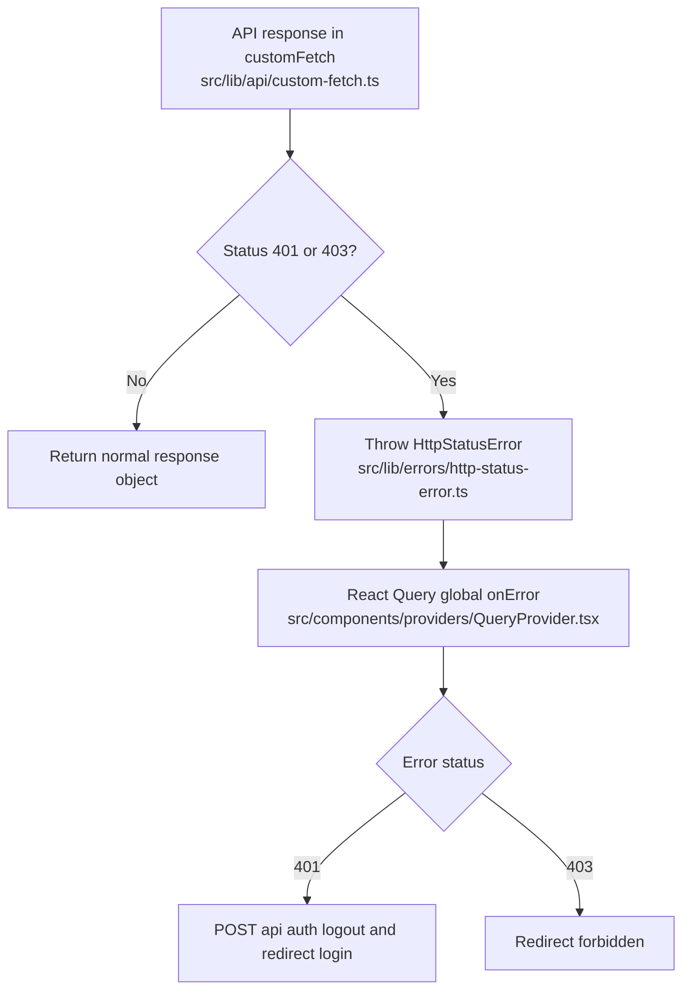

# 4. Global 401 403 Handling

```mermaid
flowchart TD
    A[API response in customFetch<br/>src/lib/api/custom-fetch.ts] --> B{Status 401 or 403?}
    B -- No --> C[Return normal response object]
    B -- Yes --> D[Throw HttpStatusError<br/>src/lib/errors/http-status-error.ts]
    D --> E[React Query global onError<br/>src/components/providers/QueryProvider.tsx]
    E --> F{Error status}
    F -- 401 --> G[POST api auth logout and redirect login]
    F -- 403 --> H[Redirect forbidden]
```

## Notes

- Removes duplicated `if status===401/403` across components.
- Gives consistent behavior across query and mutation failures.

