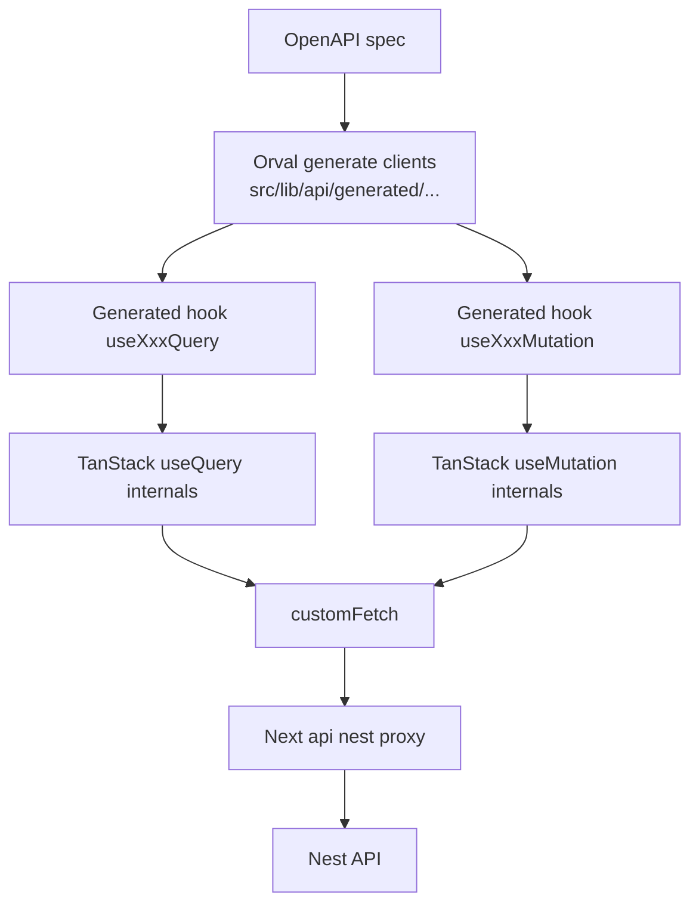

# 5. Orval And TanStack Integration

```mermaid
flowchart TD
    A[OpenAPI spec] --> B[Orval generate clients<br/>src/lib/api/generated/...]
    B --> C[Generated hook useXxxQuery]
    B --> D[Generated hook useXxxMutation]
    C --> E[TanStack useQuery internals]
    D --> F[TanStack useMutation internals]
    E --> G[customFetch]
    F --> G
    G --> H[Next api nest proxy]
    H --> I[Nest API]
```

## Notes

- You usually call generated hooks, not low-level fetch manually.
- Orval gives typed responses and query keys helpers.

