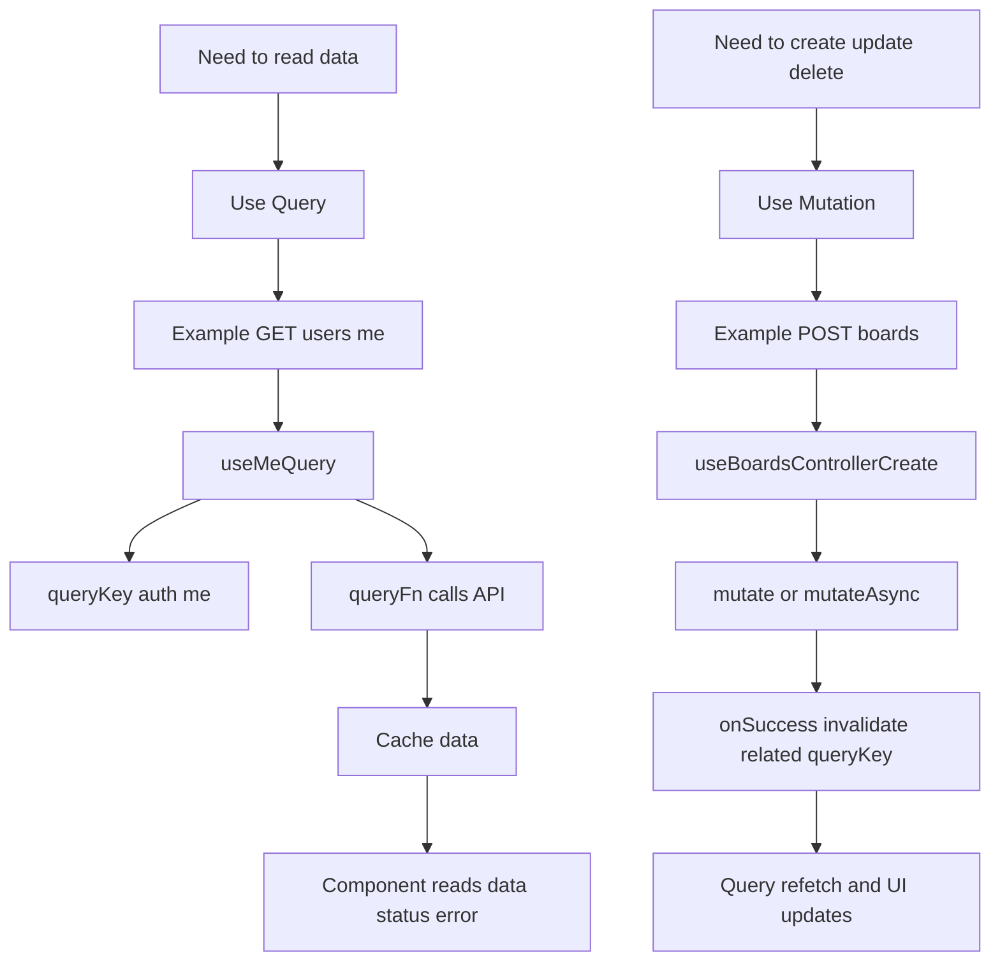

# 6. TanStack Query Mutation Basics

## What each one needs

- Query:
  - `queryKey`
  - `queryFn`
  - optional retry/stale options
- Mutation:
  - `mutationFn`
  - optional `onSuccess` and `onError`
  - usually invalidation of related query keys

