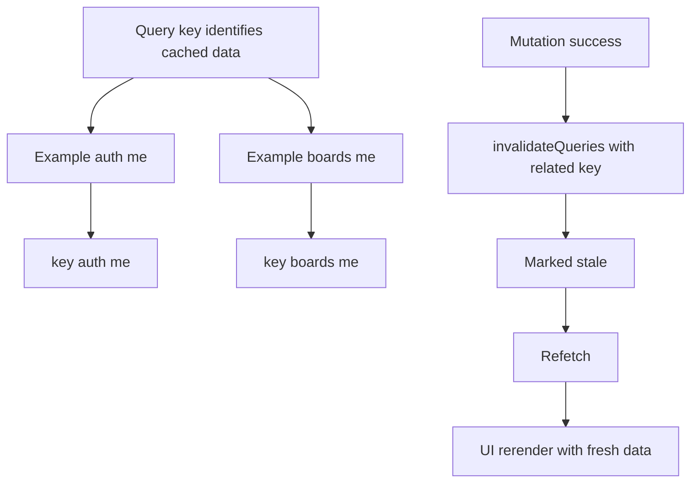

# 7. Query Key Guide

## Practical rules

- Same resource shape should always reuse the same key.
- Use Orval key helpers when available, for example `getBoardsControllerFindMyBoardsQueryKey`.
- After mutation, invalidate only keys affected by that change.

