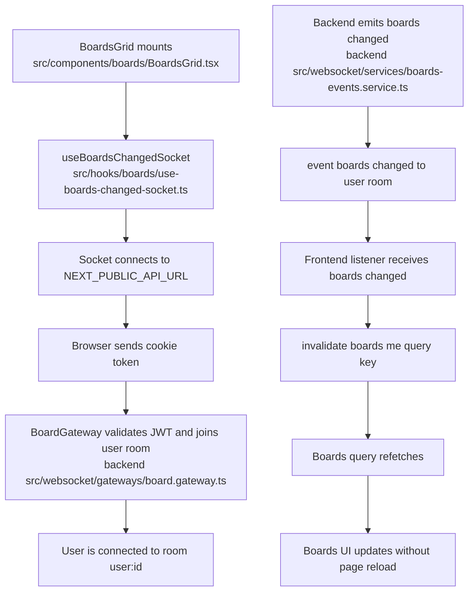

# 8. Realtime Boards Socket

```mermaid
flowchart TD
    A[BoardsGrid mounts<br/>src/components/boards/BoardsGrid.tsx] --> B[useBoardsChangedSocket<br/>src/hooks/boards/use-boards-changed-socket.ts]
    B --> C[Socket connects to NEXT_PUBLIC_API_URL]
    C --> D[Browser sends cookie token]
    D --> E[BoardGateway validates JWT and joins user room<br/>backend src/websocket/gateways/board.gateway.ts]
    E --> F[User is connected to room user:id]
    G[Backend emits boards changed<br/>backend src/websocket/services/boards-events.service.ts] --> H[event boards changed to user room]
    H --> I[Frontend listener receives boards changed]
    I --> J[invalidate boards me query key]
    J --> K[Boards query refetches]
    K --> L[Boards UI updates without page reload]
```

## Notes

- Cleanup on unmount disconnects socket to avoid duplicate listeners.
- Socket auth uses cookie fallback in gateway when no Authorization header is present.

